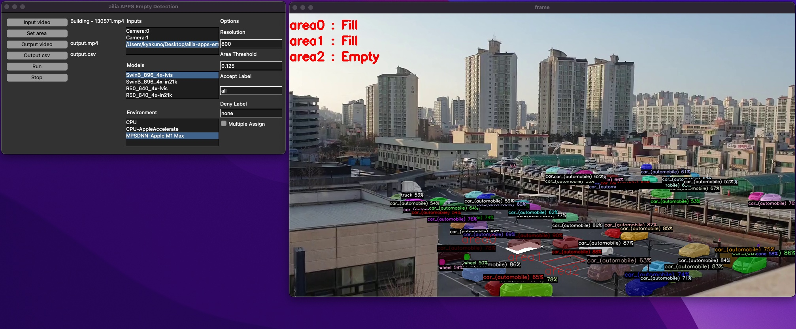

# ailia APPS Empty Detection

Detects cars in parking lots, inventory on shelves, etc., and counts vacant information.

[](https://www.youtube.com/watch?v=zgclmbgboPg)

## Functions

- Empty area detection
- Export count to csv

## Requirements

- Windows, macOS, Linux
- Python 3.7 and later
- [ailia SDK](https://github.com/axinc-ai/ailia-models/blob/master/TUTORIAL.md) 1.2.10 and later
- torch for grid sampler (`pip3 install torch`), torch is not required if you use ailia SDK 1.2.14 and later

## Basic Usage

1. Put this command to open GUI.

```
python3 ailia-apps-empty-detection.py
```


2. Push "Input video" button to select input video
3. Push "Set area" button to set area


Click on the screen to draw two lines.

4. Push "Run" button to execute the app



## Other functions

### Write output to video and csv

a. Push "Output video" button to select output video
b. Push "Output csv" button to select output csv

The examples of csv file.

```
time(sec) , area0 , area1 , area2
0 , 1 , 1 , 0
```

### Set detection resolution

You can improve performance by lowering the image recognition resolution.

### Set area threshold

Specify the ratio of whether or not to judge that an object exists when how much it overlaps.

### Set accept label

By default, all class labels are recognized.
By entering the class name in Accept Label, only a specific class label can be recognized.
For example, in the case of a parking lot, area determination can be performed only for the car by setting the Accept Label to car.
Multiple labels can be specified by separating them with commas.

### Set deny label

By default, all class labels are recognized.
By entering the class name in Deny Label, ignoring certain labels.
For example, by specifying person, it is possible to remove the effect when a person crosses the camera.
By default (none), all objects are detected and not ignored.

### Set multiple assign

By default, 1 object is assigned to 1 area that overlaps the most. Enable Multiple Assign to assign one object to multiple areas.

## Models

### SwinB or R50

SwinB is a highly accurate model using VisionTransformer. R50 is a traditional model using Convolution.

### lvis or in21k

Lvis can detects 1000 objects. In2k can detects 21000 objects.

## Architecture


## Test video

https://pixabay.com/videos/building-parking-lot-parking-car-130571/
