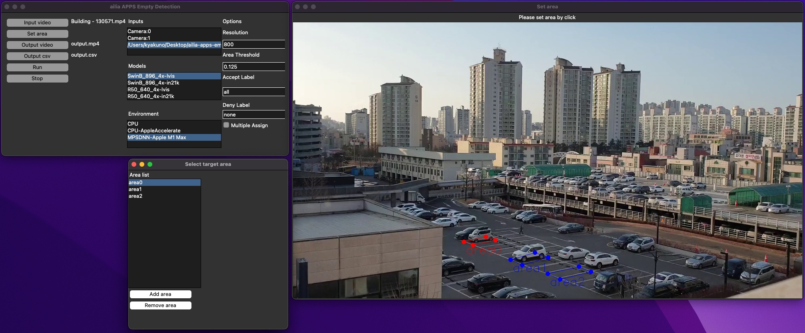

# ailia APPS Empty Detection

Detects cars in parking lots, inventory on shelves, etc., and counts vacant information.

## Functions

- Empty area detection
- Export count to csv

## Requirements

- Windows, macOS, Linux
- Python 3.7 and later
- [ailia SDK](https://github.com/axinc-ai/ailia-models/blob/master/TUTORIAL.md) 1.2.14 and later

## Basic Usage

1. Put this command to open GUI.

```
python3 ailia-apps-empty-detection.py
```


2. Push "Input video" button to select input video
3. Push "Set area" button to set area



Click on the screen to draw two lines.

4. Push "Run" button to execute the app


## Other functions

### Write output to video and csv

a. Push "Output video" button to select output video
b. Push "Output csv" button to select output csv

The examples of csv file.

```
time(sec) , area0 , area1
0 , 0 , 0
1 , 0 , 1
2 , 1 , 0
```

## Architecture


## Test video

https://pixabay.com/videos/building-parking-lot-parking-car-130571/
